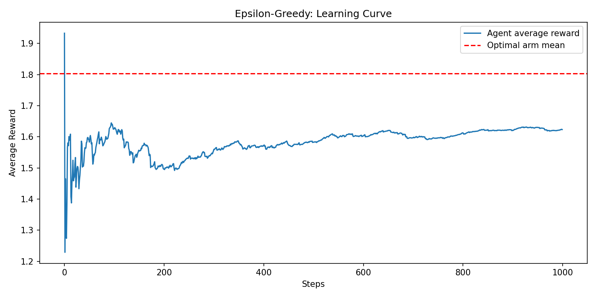
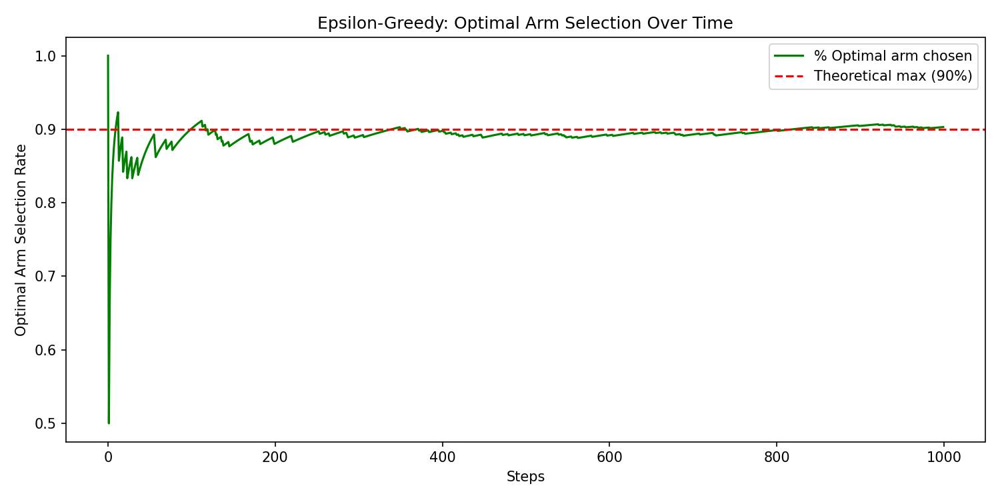
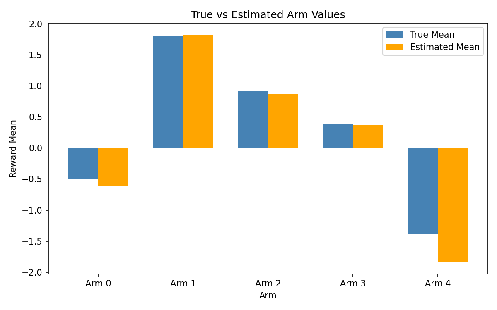

# Multi-Armed Bandit — Reinforcement Learning

A from-scratch implementation of the **Multi-Armed Bandit** problem in Python, exploring the famous RL tradeoff-- **exploration vs exploitation**. Built as part of a 30-day Reinforcement Learning study roadmap.

---

## What is the Multi-Armed Bandit Problem?

Imagine a row of slot machines (arms), each with a different — and unknown — reward distribution. Your goal is to maximize total reward over time. Pull too conservatively and you miss better arms. Explore too much and you waste pulls on bad ones.

This is the **exploration-exploitation tradeoff** — one of the foundational ideas in all of Reinforcement Learning.

---

## Implementation

### Environment — `MultiArmedBanditEnv`
- Simulates `k` arms, each with a randomly generated Gaussian reward distribution
- True means drawn from `Uniform(-2.0, 2.0)`, standard deviations from `Uniform(0.5, 1.5)`
- Tracks the optimal arm for post-simulation evaluation (present in observation.txt file).

### Agent — `EpsilonGreedyAgent`
- With probability `ε` → explores i.e. picks a random arm
- With probability `1 - ε` → exploits i.e. picks the arm with the highest estimated value/best arm
- Uses the **incremental update rule** to maintain a running average reward per arm:

$$Q(a) \leftarrow Q(a) + \frac{1}{n}\left[R - Q(a)\right]$$

---

## Results (seed=42, ε=0.1, 1000 steps)

```
Total Steps: 1000
Total Accumulated Reward: 1623.31
Average Reward Per Step: 1.62

Final Learned Values :

Arm 0: Pulled 39 times | Estimated Mean = -0.62
Arm 1: Pulled 903 times | Estimated Mean = 1.83
Arm 2: Pulled 19 times | Estimated Mean = 0.87
Arm 3: Pulled 22 times | Estimated Mean = 0.37
Arm 4: Pulled 17 times | Estimated Mean = -1.84

```

---

## Visualizations

### Learning Curve


Average reward climbs quickly as the agent identifies Arm 1, then plateaus around **1.62** — not 1.80. This gap is expected: with ε=0.1, 10% of pulls are always random and land on suboptimal arms, dragging the average down.

### Optimal Arm Selection Rate


This Shows how often the agent chose the best arm over time. The early spike and wobble reflect initial exploration uncertainty. By ~step 300 the agent converges cleanly to the **90% theoretical maximum** (the hard ceiling imposed by ε=0.1).

### True vs Estimated Arm Values


Arm 1 is near-perfectly estimated (903 pulls = large sample). Arms 2–4 have slight gaps due to fewer pulls — a direct consequence of ε-greedy's blind random exploration spending pulls on already-confirmed bad arms.

---

## Key Insight — The Limitation of ε-greedy

ε-greedy explores *randomly*, not *smartly*. Once Arm 1 is identified as best, the 10% exploration budget is wasted equally across all other arms — including clearly bad ones like Arm 4. This is why more advanced algorithms such as UCB and Thompson Sampling exist.

---

## Project Structure

```
multi-armed-bandit/
│
├── main.py          # Environment + Agent classes
├── visualize.py       # Runs simulation and saves all plots
├── results/           # Saved plots
│   ├── learning_curve.png
│   ├── optimal_selection_rate.png
│   └── true_vs_estimated.png
│── README.md
└── observation.txt

```
---

## How to Run

```bash
# Install dependencies
pip install numpy matplotlib

# Run the simulation (prints stats to terminal)
python main.py

# Generate and save all visualizations
python visualize.py
```

---

## References

- Sutton & Barto — *Reinforcement Learning: An Introduction* (Ch. 2) — [free online](http://incompleteideas.net/book/the-book.html)